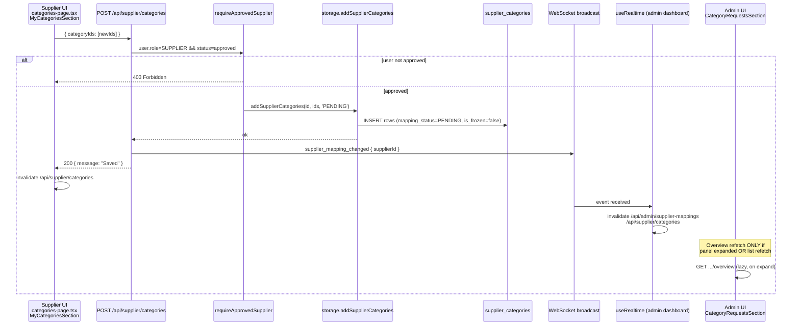
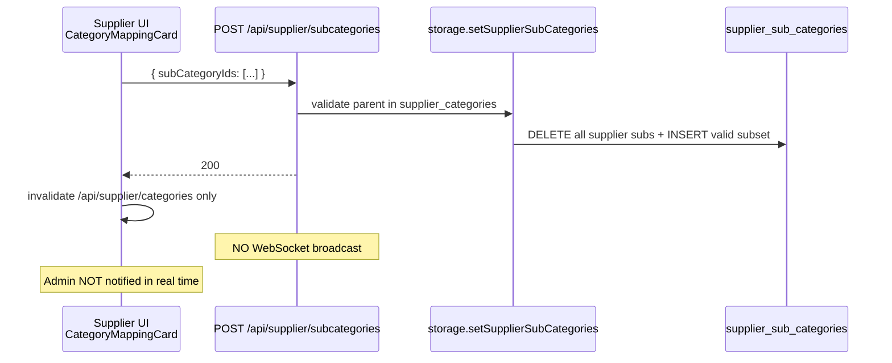
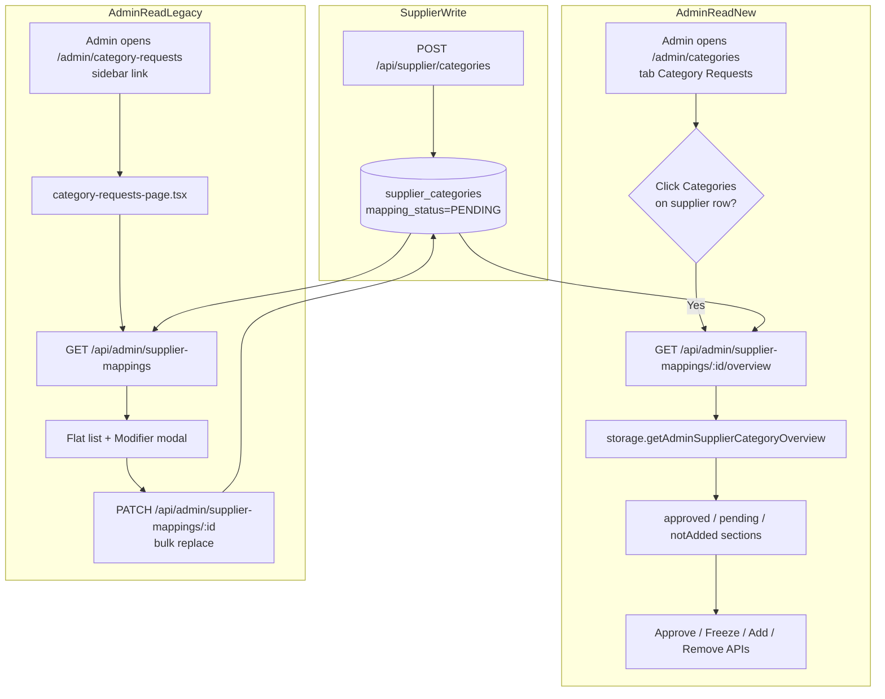

# Analyse — Synchronisation Supplier ↔ Admin (Category Mappings)

**Scope:** Supplier → Category → My Categories · Admin → Category → Category Requests · `supplier_categories` / `supplier_sub_categories` · APIs liées uniquement.

**Date:** 2026-06-25  
**Mode:** Analyse uniquement — aucun correctif appliqué dans ce document.

---

## 1. Flow diagram

### 1.1 Supplier — Ajouter une catégorie (My Categories)

### 1.2 Supplier — Sélection sous-catégories

### 1.3 Admin — Voir / approuver les mappings

### 1.4 Tables & champs

| Table | Rôle | Champs clés |
|-------|------|-------------|
| `supplier_categories` | Junction supplier ↔ catégorie catalogue | `supplier_id`, `category_id`, `mapping_status` (`APPROVED`/`PENDING`), `is_frozen` |
| `supplier_sub_categories` | Junction supplier ↔ sous-catégories cochées | `supplier_id`, `sub_category_id` (pas de status) |
| `categories` | Taxonomie globale | `status` (`ACTIVE`/`PENDING`/…) — **flux distinct** des catalog suggestions |

**Lecture commune:** `storage.getSupplierCategoryMappings(supplierId)` joint `supplier_categories` + `categories` (ACTIVE only) + `supplier_sub_categories`.

---

## 2. Broken points

### 2.1 Write issues

| ID | Sévérité | Description |
|----|----------|-------------|
| W-01 | **CRITICAL** | Fournisseur `user.status !== 'approved'` → toutes les routes `/api/supplier/categories*` retournent **403** (`requireApprovedSupplier`). L’UI My Categories est aussi bloquée par `requireApproved` dans `App.tsx`. Les demandes ne sont **jamais écrites** en DB pour un compte pending. |
| W-02 | MEDIUM | `addSupplierCategories` est **additif** (ignore les IDs déjà mappés). Pas de bug en soi, mais re-soumettre les mêmes IDs ne produit aucune ligne ni erreur visible. |
| W-03 | MEDIUM | `POST /api/supplier/subcategories` **ne déclenche pas** `broadcast("supplier_mapping_changed")`. Les changements de sous-catégories ne propagent pas côté admin. |
| W-04 | LOW | `setSupplierCategories` (PATCH bulk admin legacy) **supprime puis réinsère** toutes les lignes `supplier_categories`. Les mappings PENDING non inclus dans `categoryIds` sont **silencieusement supprimés**. |

### 2.2 Read issues

| ID | Sévérité | Description |
|----|----------|-------------|
| R-01 | **CRITICAL** | **Deux UIs admin concurrentes** pour « Category Requests » : • **Nouveau:** `/admin/categories` → onglet `Category Requests` → `SupplierCategoryOverviewPanel` (sections A/B/C, Approve/Freeze/Add). • **Legacy:** `/admin/category-requests` (lien sidebar) → `category-requests-page.tsx` → liste plate + modal `PATCH` bulk, **sans** Approve/Freeze par mapping. La sidebar pointe encore vers la page **legacy** (`app-sidebar.tsx` ligne 81). |
| R-02 | HIGH | Actions admin (Approve / Freeze / Add) visibles **uniquement après expansion** du bouton « Categories » sur chaque fournisseur dans `categories-page.tsx`. La liste repliée n’affiche qu’un compteur « N mapped categories » sans statut pending/approved. |
| R-03 | MEDIUM | `GET /api/admin/supplier-mappings` (liste) et `getDisplayCategories()` mélangent mappings **PENDING + APPROVED** sans badge de statut dans la ligne repliée. |
| R-04 | MEDIUM | `getSupplierCategoryMappings` ne retourne que des catégories catalogue `status=ACTIVE` et `isActive=true`. Une catégorie catalogue inactive n’apparaît pas même si une ligne junction existe. |
| R-05 | LOW | L’overview admin (`notAdded`) est limitée à **12 catégories** affichées (`slice(0, 12)`), le reste est masqué derrière un compteur texte. |

### 2.3 Mapping issues

| ID | Sévérité | Description |
|----|----------|-------------|
| M-01 | HIGH | **Conflit de sémantique** entre deux mécanismes d’écriture admin : • Granulaire : `POST/approve/freeze/delete .../categories/:categoryId` (préserve `mapping_status`). • Legacy : `PATCH .../supplier-mappings/:id` avec `{ categoryIds }` → `setSupplierCategories` (replace-all). Utiliser la modal legacy peut **écraser** les demandes PENDING du fournisseur. |
| M-02 | MEDIUM | `supplier_sub_categories` n’a **pas** de `mapping_status`. Les sous-catégories peuvent être cochées sur une catégorie **PENDING** (tant que la ligne parent existe dans `supplier_categories`). L’admin ne voit le détail sub-count que dans l’overview expand, pas dans la liste legacy. |
| M-03 | MEDIUM | `setSupplierSubCategories` filtre les subs dont le parent n’est pas dans `supplier_categories`. Si admin supprime la catégorie parent, les subs orphelins sont nettoyés côté `setSupplierCategories` mais pas notifiés au fournisseur explicitement. |
| M-04 | LOW | Confusion possible entre `users.status` (pending/approved compte) et `supplier_categories.mapping_status` (pending/approved mapping). L’UI admin affiche le badge « En attente » pour le **compte**, pas pour le **mapping catégorie**. |

### 2.4 Real-time issues

| ID | Sévérité | Description |
|----|----------|-------------|
| RT-01 | HIGH | Mutation supplier `saveCategories` (`categories-page.tsx`) invalide **uniquement** `/api/supplier/categories` (+ marketplace hors scope). **N’invalide pas** `/api/admin/supplier-mappings` ni `.../overview` en `onSuccess`. Dépendance totale au WebSocket pour l’admin. |
| RT-02 | MEDIUM | `supplier_mapping_changed` invalide `/api/admin/supplier-mappings` par préfixe (OK pour overview **si** TanStack Query prefix-match actif). **N’invalide pas explicitement** `["/api/admin/supplier-mappings", supplierId, "overview"]` dans le handler supplier `onSuccess`. |
| RT-03 | MEDIUM | `POST /api/supplier/subcategories` : **aucun** `broadcast`. Admin ne voit pas les changements de sous-catégories sans refresh manuel. |
| RT-04 | LOW | `useRealtime` n’est monté que dans `dashboard-layout.tsx`. Si l’admin n’a pas le layout actif (onglet inactif, autre fenêtre), pas de push — comportement attendu mais perçu comme désync. |
| RT-05 | LOW | `invalidateSupplierMappingQueries` dans `use-realtime.ts` appelle `invalidateMarketplace` (hors scope catégories ; pas bloquant pour ce flux). |

---

## 3. Validation checklist (état actuel du code)

| Question | Réponse |
|----------|---------|
| L’action supplier crée-t-elle une ligne DB ? | **Oui**, si `user.status === 'approved'` : `INSERT` dans `supplier_categories` avec `mapping_status = 'PENDING'` via `addSupplierCategories`. |
| L’endpoint admin lit-il la même table ? | **Oui** : `getAdminSupplierCategoryOverview` → `getSupplierCategoryMappings` → lecture `supplier_categories`. |
| L’UI admin interprète-t-elle `mapping_status` ? | **Oui**, mais **uniquement** dans `SupplierCategoryOverviewPanel` (`categories-page.tsx`), pas sur la page legacy. |
| Un endpoint legacy écrase-t-il les données ? | **Oui** : `PATCH /api/admin/supplier-mappings/:id` via `setSupplierCategories` (replace-all). |
| Problème de cache React Query ? | **Partiel** : supplier rafraîchit sa query ; admin liste dépend du WS ; overview lazy-load au expand. |
| WebSocket déclenché sur add category ? | **Oui** sur `POST /api/supplier/categories`. **Non** sur `POST /api/supplier/subcategories`. |

---

## 4. Fichiers impliqués dans la désynchronisation

| Fichier | Rôle dans le problème |
|---------|------------------------|
| `client/src/components/layout/app-sidebar.tsx` | Lien « Category Requests » → `/admin/category-requests` (UI legacy) au lieu de l’onglet intégré. |
| `client/src/pages/admin/category-requests-page.tsx` | Page standalone **sans** `SupplierCategoryOverviewPanel` ; utilise `PATCH` bulk. |
| `client/src/pages/admin/categories-page.tsx` | UI correcte (overview A/B/C) mais **cachée** derrière expand ; `CategoryEditModalInline` legacy encore présent. |
| `client/src/pages/supplier/categories-page.tsx` | Écrit via POST ; invalide admin queries **non** en `onSuccess`. |
| `server/routes.ts` | `requireApprovedSupplier` sur toutes routes supplier categories ; subcategories sans broadcast. |
| `server/storage.ts` | `addSupplierCategories` (additif PENDING) vs `setSupplierCategories` (replace-all) — sémantiques opposées. |
| `client/src/hooks/use-realtime.ts` | Invalidation admin partielle ; pas de handler dédié subcategories. |
| `shared/schema.ts` | `supplier_categories.mapping_status`, `is_frozen` (nécessite migration `0002_supplier_category_mapping.sql` / `db:push`). |
| `client/src/App.tsx` | `requireApproved` bloque `/supplier/categories` pour comptes pending. |

**Fichiers hors scope (non cause directe du bug catégorie, mais touchés par invalidation) :** `invalidate-marketplace.ts`, `manage-products.tsx` — à ne pas modifier dans le correctif ciblé.

---

## 5. Minimal fix plan (DO NOT IMPLEMENT YET)

### P0 — Aligner l’entrée admin (1 fichier routing/nav)

1. **Unifier la navigation admin** : faire pointer « Category Requests » sidebar vers `/admin/categories?section=category-requests` **OU** remplacer le contenu de `category-requests-page.tsx` par `SupplierCategoryOverviewPanel` + liste fournisseurs (réutiliser composant extrait).
2. **Déprécier** `PATCH /api/admin/supplier-mappings/:id` pour les fournisseurs dans l’UI (garder l’API pour compatibilité, retirer les modals legacy supplier).

### P1 — Sync écriture ↔ lecture (API + mutations, ~4 touch points)

3. **`POST /api/supplier/subcategories`** : ajouter `broadcast("supplier_mapping_changed", { supplierId })` dans `server/routes.ts`.
4. **Supplier `onSuccess`** (`categories-page.tsx`) : invalider aussi `["/api/admin/supplier-mappings"]` (le préfixe couvrira les overviews).
5. **Admin `SupplierCategoryOverviewPanel`** : après mutation, invalider déjà OK — vérifier que la liste repliée affiche un badge **« X pending »** sans expand obligatoire.

### P2 — UX admin sans refactor architecture (~2 touch points)

6. Afficher dans la ligne fournisseur (liste repliée) : `approvedCount`, `pendingCount`, `frozenCount` dérivés de `/api/admin/supplier-mappings` (données déjà dans `mappings[].mappingStatus` / `isFrozen`).
7. Auto-expand ou highlight si `pendingCount > 0` pour guider l’admin vers les actions.

### P3 — Garde-fous mapping (storage, 1 fonction)

8. **`setSupplierCategories`** : ne plus supprimer les lignes `mapping_status = 'PENDING'` non présentes dans `categoryIds` **OU** interdire l’appel PATCH bulk quand des PENDING existent (fail-safe côté API).

### P4 — Vérification déploiement

9. Confirmer en base que `supplier_categories.mapping_status` et `is_frozen` existent (migration `0002` appliquée).
10. Test manuel script :
    - Supplier approuvé → Add Category → vérifier row `PENDING` en DB.
    - Admin `/admin/categories` → Category Requests → expand → section B visible.
    - Approve → `mapping_status = APPROVED` ; supplier voit bordure verte sans refresh (WS).

### Hors scope explicite (ne pas toucher)

- Marketplace, listings, variants, products UI
- Auth gate `PendingApprovalScreen` (sauf documenter que pending users ne peuvent pas soumettre)
- Catalog suggestions (`/api/supplier/catalog-suggestions`) — flux taxonomy séparé

---

## 6. Résumé exécutif

| Cause racine | Impact |
|--------------|--------|
| **Double page admin** (legacy vs nouvelle) | Admin utilise la mauvaise page → pas d’Approve/Freeze/sections A/B/C |
| **Actions cachées derrière expand** | Même sur la bonne page, admin ne voit pas les actions sans clic |
| **Invalidation admin absente côté supplier mutation** | Dépendance WebSocket ; désync si WS absent ou panel non monté |
| **Subcategories sans broadcast** | Compteur subs admin stale |
| **PATCH bulk legacy** | Peut supprimer des mappings PENDING fournisseur |
| **Compte supplier non approuvé** | Aucune écriture possible (403) — perçu comme « rien ne remonte » |

**Conclusion :** Le flux DB **Supplier → `supplier_categories` → Admin API overview** est cohérent **si** l’admin utilise `/admin/categories` (onglet Category Requests, panel expand) et que le fournisseur est **approuvé**. La désynchronisation perçue vient surtout de la **UI admin legacy** (sidebar), de l’**invalidation React Query incomplète**, et du **manque de broadcast sur subcategories** — pas d’un défaut de lecture sur la table junction elle-même.
