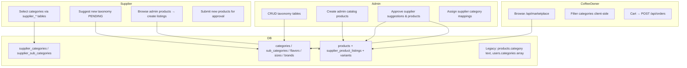

# Shop Module — Complete Technical Audit Report

**Project:** bigbosscoffee-main  
**Date:** 2026-06-23  
**Scope:** End-to-end audit of the shop/marketplace module across Admin, Supplier, and Coffee Owner roles  
**Mode:** Analysis only — no code was modified  

---

## Executive Summary

The shop module is implemented as a **marketplace at `/products`** (not `/shop`). The role **Coffee Owner** maps to `CAFE_OWNER` in the codebase. The system uses a **three-layer product model**: Admin catalog (`products.isAdminProduct=true`) → Supplier listings (`supplier_product_listings` + variants) → Café marketplace (`/api/marketplace`).

The marketplace commercial-access model (price stripping for visitors and pending café owners) is **well implemented** on `/api/marketplace`. However, **critical bugs** in supplier category mappings, broken admin product-approval UI, unprotected order APIs, and a parallel **legacy product system** (`/api/products`) undermine synchronization, security, and business logic across all three roles.

**Highest-impact finding:** `getSupplierCategoryMappings()` returns **all** active categories instead of only supplier-selected ones, breaking category selection, admin-product filtering, and supplier UI statistics.

---

## Module Mapping & Terminology

| User term | Codebase equivalent |
|-----------|---------------------|
| Shop module | `/products`, `/products/:productId`, `/cart`, `/api/marketplace` |
| Coffee Owner | `CAFE_OWNER` role |
| Admin | `SUPER_ADMIN`, `ADMIN` |
| Supplier | `SUPPLIER` |

**Key files:**

| Area | Path |
|------|------|
| Schema (Drizzle, not Prisma) | `shared/schema.ts` |
| HTTP routes & guards | `server/routes.ts` |
| Business logic / DB access | `server/storage.ts` |
| Frontend routes | `client/src/App.tsx` |
| Admin taxonomy & products | `client/src/pages/admin/categories-page.tsx`, `products-page.tsx` |
| Supplier categories & products | `client/src/pages/supplier/categories-page.tsx`, `manage-products.tsx` |
| Café browse & detail | `client/src/pages/cafe/browse-products.tsx`, `product-detail-page.tsx` |
| Supplier category Zustand store | `client/src/store/supplier-category-store.ts` |
| Cart (Zustand) | `client/src/hooks/use-cart.ts` |
| React Query config | `client/src/lib/queryClient.ts` |
| Realtime invalidation | `client/src/hooks/use-realtime.ts` |

---

## Architecture Overview



**Intended flow:**
1. Admin creates taxonomy and catalog products (`isAdminProduct=true`).
2. Supplier selects categories/subcategories → persisted in `supplier_categories` / `supplier_sub_categories`.
3. Supplier browses Admin Products tab → server filters by mappings → creates listings with variants.
4. Marketplace shows admin products with in-stock supplier listings.
5. Approved café owners see prices and can order.

**Current breakpoints:** Step 2 mapping read is broken (Issue #1). Step 4 supplier product approval UI is broken (Issue #2). Order APIs lack role/ownership enforcement (Issues #3–#6).

---

# 1. Authentication & Role Access Analysis

## 1.1 Route Protection (Frontend)

**Location:** `client/src/App.tsx` — `ProtectedRoute` component (lines ~72–77)

| Route | Guard | Who can access |
|-------|-------|----------------|
| `/products`, `/products/:productId` | **None** | Everyone (public browse) |
| `/cart` | `CAFE_OWNER` only | Approved café owners at route level |
| `/cafe/settings`, `/cafe/orders` | `CAFE_OWNER` only | Café owners |
| `/cafe/messages` | **None** | Everyone |
| `/orders` | Any authenticated user | All logged-in roles |
| `/supplier/*` (16 routes) | `SUPPLIER` only | Suppliers |
| `/admin/*` (12 routes) | `SUPER_ADMIN`, `ADMIN` | Admins |

**Behavior:** Unauthenticated users → `/auth`. Wrong role → `/` (not 403).

### Issue AUTH-01 — Cart route vs commercial UI mismatch

| Field | Detail |
|-------|--------|
| **Location** | `client/src/App.tsx` (`/cart` guard), `marketplace-layout.tsx`, `product-detail-page.tsx` |
| **Explanation** | Frontend grants `hasCommercial=true` to Admin and Supplier (can see prices, add-to-cart UI). `/cart` route is restricted to `CAFE_OWNER` only. |
| **Impact** | **Admin/Supplier:** Can add items in UI but get redirected to `/` when opening cart. **Coffee Owner:** No issue if approved. |
| **Why it breaks** | Inconsistent UX; implies ordering is possible for roles that cannot complete checkout via UI. |

### Issue AUTH-02 — `/dashboard` redirect to non-existent route

| Field | Detail |
|-------|--------|
| **Location** | `client/src/pages/landing-page.tsx` (~line 152) |
| **Explanation** | Landing page redirects admin/supplier to `/dashboard`, but no `/dashboard` route exists in `App.tsx`. |
| **Impact** | **Admin/Supplier:** Likely 404 after login from landing. |
| **Why it breaks** | Broken navigation for non-café roles. |

### Issue AUTH-03 — `/cafe/messages` unprotected

| Field | Detail |
|-------|--------|
| **Location** | `client/src/App.tsx` (~lines 261–267) |
| **Explanation** | No `ProtectedRoute` on messages page. |
| **Impact** | **All roles:** Page accessible without auth (currently mock data). |
| **Why it breaks** | No auth boundary when real messaging is implemented. |

---

## 1.2 API Authorization (Backend)

**Location:** `server/routes.ts`

| Middleware | Behavior |
|------------|----------|
| `requireAuth` | Session `userId` required |
| `requireAdmin` | `SUPER_ADMIN` or `ADMIN` |
| Inline supplier check | `user.role !== 'SUPPLIER'` → 403 |
| **Missing** | `requireCafeOwnerApproved`, `requireSupplierApproved`, listing ownership checks |

### Marketplace commercial access (correct)

**Location:** `server/routes.ts` — `hasCommercialAccess()` (~lines 1085–1091), `stripCommercialData()`

- **Full access:** `SUPER_ADMIN`, `ADMIN`, `SUPPLIER`, or `CAFE_OWNER` with `status === 'approved'`
- **Stripped:** Visitors and pending café owners get `listings: []`, `bestPrice: null`, `supplierCount: 0`

### Issue AUTH-04 — Order creation without role or approval check

| Field | Detail |
|-------|--------|
| **Location** | `server/routes.ts` — `POST /api/orders` (~lines 367–385) |
| **Explanation** | Only `requireAuth`. No check for `CAFE_OWNER`, no `status === 'approved'`. |
| **Impact** | **Coffee Owner (pending):** Can place orders via API bypassing UI. **Supplier/Admin/any role:** Can also create orders. |
| **Why it breaks** | Business rule "only approved café owners can order" is enforced in UI only, not API. |

### Issue AUTH-05 — Order read IDOR (Insecure Direct Object Reference)

| Field | Detail |
|-------|--------|
| **Location** | `server/routes.ts` — `GET /api/orders/:id` (~lines 361–365) |
| **Explanation** | Returns any order to any authenticated user. No ownership check (cafe, supplier, admin). |
| **Impact** | **All roles:** Can read other users' orders by guessing/enumerating IDs. |
| **Why it breaks** | Data leak across café owners, suppliers, and drivers. |

### Issue AUTH-06 — Order status update without role or ownership check

| Field | Detail |
|-------|--------|
| **Location** | `server/routes.ts` — `PATCH /api/orders/:id/status` (~lines 392–400) |
| **Explanation** | Any authenticated user can change order status. |
| **Impact** | **Coffee Owner:** Could mark others' orders `DELIVERED` or `CANCELLED`. **Supplier/Driver:** Same. |
| **Why it breaks** | Order lifecycle integrity destroyed; no authorization on state transitions. |

### Issue AUTH-07 — Legacy `/api/products` public price leak

| Field | Detail |
|-------|--------|
| **Location** | `server/routes.ts` — `GET /api/products`, `GET /api/products/:id` (~lines 185–202) |
| **Explanation** | No auth. Returns full `price`, `stock`, `supplier` with no commercial stripping. |
| **Impact** | **Visitors / pending café owners:** Bypass marketplace price-hiding entirely. |
| **Why it breaks** | Parallel API undermines the entire commercial-access model of `/api/marketplace`. |

### Issue AUTH-08 — Legacy product mutations without role check

| Field | Detail |
|-------|--------|
| **Location** | `server/routes.ts` — `POST/PUT/DELETE /api/products` (~lines 204–228) |
| **Explanation** | `requireAuth` only. Any logged-in user can create/update/delete products. |
| **Impact** | **Coffee Owner (pending), Supplier, etc.:** Can mutate catalog via API. |
| **Why it breaks** | No role-based write protection on legacy product endpoints. |

### Issue AUTH-09 — Cross-supplier listing tampering

| Field | Detail |
|-------|--------|
| **Location** | `server/routes.ts` — `PATCH/DELETE /api/supplier/listings/:id` (~lines 1041–1078) |
| **Explanation** | Checks `role === SUPPLIER` but never verifies `listing.supplierId === user.id`. |
| **Impact** | **Supplier A:** Can modify/delete Supplier B's listings if listing ID is known. |
| **Why it breaks** | Multi-tenant isolation failure on supplier commercial data. |

### Issue AUTH-10 — Supplier product endpoints ignore account status

| Field | Detail |
|-------|--------|
| **Location** | All `/api/supplier/*` routes in `server/routes.ts` |
| **Explanation** | Only `role === SUPPLIER'` checked. `user.status` (pending/approved) never validated. |
| **Impact** | **Pending suppliers:** Can create listings, suggest categories, submit products. |
| **Why it breaks** | Onboarding approval gate exists for accounts but not for supplier commercial actions. |

### Issue AUTH-11 — Admin sees all orders unfiltered

| Field | Detail |
|-------|--------|
| **Location** | `server/routes.ts` — `GET /api/orders` (~lines 348–355) |
| **Explanation** | Filters applied only for `CAFE_OWNER`, `SUPPLIER`, `DRIVER`. Admin gets unfiltered list. |
| **Impact** | **Admin:** Full order visibility (may be intentional). Combined with IDOR, expands exposure. |
| **Why it breaks** | Acceptable for admin; dangerous when combined with AUTH-05/06. |

### Issue AUTH-12 — Plaintext password comparison

| Field | Detail |
|-------|--------|
| **Location** | `server/routes.ts` — login handler (~line 116) |
| **Explanation** | `user.password !== password` direct comparison. |
| **Impact** | **All roles:** Weak credential security undermines all RBAC. |
| **Why it breaks** | Foundational security issue affecting every role boundary. |

---

## 1.3 Frontend Permission Logic

Commercial access is duplicated in **four places** with matching rules:

| File | Helper |
|------|--------|
| `browse-products.tsx` | `useCommercialAccess()` |
| `product-detail-page.tsx` | `useAccess()` |
| `marketplace-layout.tsx` | `computeAccess()` |
| `barista-page.tsx`, `marketing-page.tsx` | Inline logic |

**Rules (consistent on frontend):**
- Visitor → no commercial data
- `CAFE_OWNER` + pending → browse only
- `CAFE_OWNER` + approved → full commercial
- `SUPER_ADMIN` / `ADMIN` / `SUPPLIER` → full commercial

### Issue AUTH-13 — Duplicated commercial-access logic (drift risk)

| Field | Detail |
|-------|--------|
| **Location** | 4 client files + `hasCommercialAccess()` on server |
| **Explanation** | Same rules copy-pasted; must be manually kept in sync. |
| **Impact** | **All roles:** Future changes may desync UI and API behavior. |
| **Why it breaks** | No single source of truth for access rules. |

### Issue AUTH-14 — Profile modal orders not gated by commercial access

| Field | Detail |
|-------|--------|
| **Location** | `marketplace-layout.tsx` (~lines 863–881) |
| **Explanation** | Any logged-in user on shop pages can open profile → Orders tab, calling `/api/orders`. |
| **Impact** | **Supplier/Admin:** See orders per backend filters while browsing shop. |
| **Why it breaks** | Shop UX exposes order data to non-buyer roles without explicit intent. |

---

## 1.4 Backend vs Frontend Enforcement Matrix

| Feature | Frontend | Backend | Consistent? |
|---------|----------|---------|-------------|
| Public product browse | Open | Open | ✅ |
| Hide prices from visitors | Yes | `stripCommercialData` | ✅ |
| Pending café blocked | Yes | `hasCommercialAccess` | ✅ |
| Place orders | UI: approved café only | API: any auth user | ❌ |
| View order by ID | N/A | No ownership | ❌ |
| Update order status | UI: role-specific | API: any auth user | ❌ |
| Legacy `/api/products` prices | Not used by shop browse | Fully public | ❌ Bypass |
| Product CRUD (legacy) | Not in shop UI | Any auth user | ❌ |

---

# 2. Category System Analysis

## 2.1 Admin — Source of Truth

**Expected:** Admin is the sole creator of categories, subcategories, and taxonomy structure. Suppliers may only **suggest** new entries (PENDING).

**Implementation:**

| Capability | API | Auth | UI |
|------------|-----|------|-----|
| CRUD categories | `POST/PATCH/DELETE /api/categories` | `requireAdmin` | `admin/categories-page.tsx` |
| CRUD subcategories | `/api/subcategories` | `requireAdmin` | Same |
| CRUD flavors/sizes/brands | `/api/flavors`, `/api/sizes`, `/api/brands` | `requireAdmin` | Same |
| Approve supplier suggestions | `PATCH /api/admin/catalog-suggestions/:type/:id/approve` | `requireAdmin` | Supplier Categories section |
| Assign supplier mappings | `PATCH /api/admin/supplier-mappings/:supplierId` | `requireAdmin` | `category-requests-page.tsx` |

**Public read:** `GET /api/categories`, `/subcategories`, `/flavors`, `/sizes`, `/brands` — only `status = 'ACTIVE'`.

### Issue CAT-01 — Supplier can create PENDING taxonomy (by design, but not sole-admin creation)

| Field | Detail |
|-------|--------|
| **Location** | `POST /api/supplier/catalog-suggestions`, `server/storage.ts` |
| **Explanation** | Suppliers insert rows with `createdBySupplier=true`, `status=PENDING`. Admin must approve. |
| **Impact** | **Admin:** Must review suggestions. **Supplier:** Can propose structure. Not a bug if workflow is intentional. |
| **Why it matters** | Admin is not the *only* creator — suppliers initiate, admin approves. Document as business rule. |

### Issue CAT-02 — No dedicated reject endpoint for catalog suggestions

| Field | Detail |
|-------|--------|
| **Location** | `server/routes.ts` — catalog-suggestions handlers |
| **Explanation** | Rejection only via `PATCH` with `status: 'REJECTED'` or `DELETE`. UI has REJECTED filter but approve path never sets REJECTED. |
| **Impact** | **Admin:** Awkward rejection workflow. **Supplier:** Unclear rejection state. |
| **Why it breaks** | Incomplete approval lifecycle for taxonomy suggestions. |

### Issue CAT-03 — Dual admin UIs for category requests

| Field | Detail |
|-------|--------|
| **Location** | `admin/categories-page.tsx` (embedded section), `admin/category-requests-page.tsx` (standalone) |
| **Explanation** | Overlapping concerns for provider category assignment. |
| **Impact** | **Admin:** Confusion, possible inconsistent actions. |
| **Why it breaks** | Duplicated admin workflows for same data. |

### Issue CAT-04 — `isActive` vs `status` desync on taxonomy

| Field | Detail |
|-------|--------|
| **Location** | `shared/schema.ts` (taxonomy tables), `server/storage.ts` — `getCategories()`, `buildTaxonomyCache()` |
| **Explanation** | Rows have both `is_active` boolean and `status` text (`ACTIVE`/`PENDING`/`REJECTED`). Server filters only on `status = 'ACTIVE'`, not `isActive`. Admin PATCH can set `isActive: false` while `status` stays `ACTIVE`. |
| **Impact** | **Admin:** Toggle may not hide category from API. **Coffee Owner:** Sees categories admin thought were disabled. |
| **Why it breaks** | Two activation flags with no single source of truth. |

### Issue CAT-05 — `getCategories()` subcategory count includes non-ACTIVE subs

| Field | Detail |
|-------|--------|
| **Location** | `server/storage.ts` — `getCategories()` (~line 426) |
| **Explanation** | Counts subcategories without filtering `status = 'ACTIVE'`, while `getSubCategories()` does filter. |
| **Impact** | **Coffee Owner:** Category strip `productCount` may be inflated. **Admin:** Misleading counts. |
| **Why it breaks** | Inconsistent ACTIVE filtering between related queries. |

### Issue CAT-06 — Hard deletes on taxonomy without cascade

| Field | Detail |
|-------|--------|
| **Location** | `server/storage.ts` — `deleteCategory()`, `deleteSubCategory()`, etc. |
| **Explanation** | Hard delete with no FK constraints (see DB section). Products may reference deleted taxonomy IDs. |
| **Impact** | **Admin:** Deleting category orphans products. **Supplier/Coffee Owner:** Broken filters and labels. |
| **Why it breaks** | No referential integrity at DB or application cascade level. |

---

## 2.2 Supplier — Category Selection & Approval

**UI:** `client/src/pages/supplier/categories-page.tsx`

**Flow:**
1. Select categories → `POST /api/supplier/categories` → `supplier_categories`
2. Toggle subcategories → `POST /api/supplier/subcategories` → `supplier_sub_categories`
3. Suggest new taxonomy → `POST /api/supplier/catalog-suggestions` → PENDING rows
4. Admin approves → ACTIVE + WebSocket broadcast via `use-realtime.ts`

**Zustand store:** `client/src/store/supplier-category-store.ts`
- Persists `selectedCategoryId` / `selectedSubCategoryId` to localStorage (`"supplier-category-selection"`)
- Used for **My Products** tab single-selection navigation
- **Admin Products** tab uses DB multi-mapping (server-side filter)

Documented dual model: `.agents/memory/supplier-category-products.md`

### Issue CAT-07 — CRITICAL: `getSupplierCategoryMappings()` returns ALL categories

| Field | Detail |
|-------|--------|
| **Location** | `server/storage.ts` — lines 578–588 |
| **Explanation** | `selectedCatIds` is computed from `supplier_categories` but **never used to filter**. Returns `allCats.map(...)` for every ACTIVE category. |
| **Impact** | **Supplier:** Categories page shows all system categories as mapped; stats wrong; admin-products filter includes all categories; selection modal pre-checks all. **Admin:** Supplier mapping display incorrect. **Coffee Owner:** Indirect — suppliers see wrong admin products. |
| **Why it breaks** | Core supplier scope mechanism is non-functional. Every downstream filter that uses `supplierMappings.map(m => m.category.id)` treats all categories as selected. |

```578:588:server/storage.ts
  async getSupplierCategoryMappings(supplierId: number): Promise<SupplierCategoryMapping[]> {
    const allCats = await db.select().from(categories).where(eq(categories.status, 'ACTIVE'));
    // ...
    const selectedCatIds = new Set(supplierCats.map((sc) => sc.categoryId));
    return allCats.map((cat) => ({
      category: cat,
      subCategories: allSubs.filter((s) => s.categoryId === cat.id),
      selectedSubCategoryIds: supplierSubs.filter(...).map(...),
    }));
  }
```

**Expected fix:** `return allCats.filter(cat => selectedCatIds.has(cat.id)).map(...)`

### Issue CAT-08 — Orphan subcategories when deselecting categories

| Field | Detail |
|-------|--------|
| **Location** | `server/storage.ts` — `setSupplierCategories()` (~lines 591–596) |
| **Explanation** | Replacing `supplier_categories` does not prune `supplier_sub_categories` for removed categories. |
| **Impact** | **Supplier:** Subcategory junction rows remain for deselected categories. **Admin:** Mapping display shows stale subs. |
| **Why it breaks** | Category and subcategory selections are decoupled on write. |

### Issue CAT-09 — Zustand selection vs DB mapping desync

| Field | Detail |
|-------|--------|
| **Location** | `supplier-category-store.ts`, `categories-page.tsx`, `manage-products.tsx` |
| **Explanation** | Zustand persists UI selection in localStorage independently of `supplier_categories` / `supplier_sub_categories`. Admin can change mappings without clearing Zustand. |
| **Impact** | **Supplier:** My Products / Admin Products nav may point at deselected category until store is manually reset. |
| **Why it breaks** | Two selection models (UI state vs DB) with no reconciliation. |

### Issue CAT-10 — Supplier can save subcategories for unselected categories

| Field | Detail |
|-------|--------|
| **Location** | `POST /api/supplier/subcategories` — flat list of sub IDs |
| **Explanation** | Subcategory IDs saved globally without validating parent category is in `supplier_categories`. |
| **Impact** | **Supplier:** Can check subs for categories not selected. **Admin:** Inconsistent mapping data. |
| **Why it breaks** | Missing validation linking subs to selected categories. |

### Issue CAT-11 — WebSocket does not invalidate supplier category queries

| Field | Detail |
|-------|--------|
| **Location** | `client/src/hooks/use-realtime.ts` |
| **Explanation** | Invalidates `/api/categories`, `/api/subcategories`, catalog-suggestions — but **not** `/api/supplier/categories` or `/api/supplier/admin-products`. |
| **Impact** | **Supplier:** Stale category/mapping data after admin changes. Cross-tab desync. |
| **Why it breaks** | Incomplete realtime sync for supplier-scoped data. |

### Issue CAT-12 — Legacy `SUPPLIER_CATS` dead code at registration

| Field | Detail |
|-------|--------|
| **Location** | `client/src/pages/auth-page.tsx` (~line 41) |
| **Explanation** | `SUPPLIER_CATS` preset strings defined but `SupplierForm` no longer sends categories at signup. |
| **Impact** | **Supplier:** Category selection only post-login (correct flow) but dead code remains. |
| **Why it matters** | Legacy confusion; `users.categories` may still exist for other roles. |

### Issue CAT-13 — Mock categories in supplier inventory page

| Field | Detail |
|-------|--------|
| **Location** | `client/src/pages/supplier/inventory-page.tsx` |
| **Explanation** | Hardcoded demo categories, not connected to DB taxonomy. |
| **Impact** | **Supplier:** Misleading inventory UI if used. |
| **Why it breaks** | Parallel fake data source outside taxonomy system. |

---

## 2.3 Coffee Owner — Category Visibility

**UI:** `browse-products.tsx`, `marketplace-layout.tsx`

| Rule | Implementation |
|------|----------------|
| Browse products | Public; prices hidden unless commercial access |
| Category strip | `GET /api/categories` — only categories with `productCount > 0` |
| Filtering | **Client-side** on full `/api/marketplace` payload |
| Per-café category restrictions | **None** — no `users.categories` for shop |
| Account gate | `CAFE_OWNER` + `status === 'approved'` for prices/ordering |

### Issue CAT-14 — Marketplace ignores server category filter params

| Field | Detail |
|-------|--------|
| **Location** | `browse-products.tsx` (~line 211) |
| **Explanation** | Always fetches `GET /api/marketplace` with no query params. Server supports `?categoryId=`, `?subCategoryId=`, `?search=` but client filters locally. |
| **Impact** | **Coffee Owner:** Works functionally but inefficient; stale full payload cached. |
| **Why it breaks** | Performance/scalability issue; server filtering unused. |

### Issue CAT-15 — Product badge uses legacy `category` text, not taxonomy label

| Field | Detail |
|-------|--------|
| **Location** | `browse-products.tsx` — ProductCard (~lines 72–75) |
| **Explanation** | Displays `product.category` (denormalized text) instead of `categoryLabel` from taxonomy enrichment. |
| **Impact** | **Coffee Owner:** Badge may not match filter behavior (which uses `categoryId`). |
| **Why it breaks** | Dual category field on products can diverge after admin renames category. |

### Issue CAT-16 — Coffee owners see all ACTIVE categories with products (no geo/supplier filter)

| Field | Detail |
|-------|--------|
| **Location** | `getMarketplaceProducts()`, `browse-products.tsx` |
| **Explanation** | No filter on supplier approval, governorate, or café-specific category scope. |
| **Impact** | **Coffee Owner:** Full catalog visibility (may be intentional B2B model). |
| **Why it matters** | Document as missing business rule if geographic/supplier scoping is required. |

---

## 2.4 Legacy Category Systems (Conflicts)

| System | Location | Used for |
|--------|----------|----------|
| **Normalized taxonomy** | `categories`, `sub_categories`, FK on `products` | Shop marketplace, supplier products |
| **`products.category` text** | `products.category` column | Legacy filter in `getProducts()`, café product card badge |
| **`users.categories` text[]** | `users` table | PRINTER, MARKETING, BARISTA, DELIVERY registration; admin assignment |
| **`SUPPLIER_CATS` presets** | `auth-page.tsx` | Dead code |
| **Mock categories** | `supplier/inventory-page.tsx` | Demo only |

**Registration** still accepts `categories: string[]` in register schema (`routes.ts`) but supplier form no longer sends it.

---

# 3. Product System Analysis

## 3.1 Admin Products

**UI:** `client/src/pages/admin/products-page.tsx`

- **Catalog tab:** CRUD via `ProductFormModal` with dependent taxonomy dropdowns
- **Supplier Products tab:** Review queue for supplier-submitted products

**Creation API:** `POST /api/admin/products` (`routes.ts` ~249–274)
- Sets taxonomy FKs + `flavorIds`/`sizeIds`
- Forces `isAdminProduct: true`, `price: 0`, `stock: 0`

**Storage:** `getAdminProducts()` — filters inactive/rejected categories, enriches taxonomy labels.

### Issue PROD-01 — CRITICAL: Admin supplier-product approval UI calls wrong endpoint

| Field | Detail |
|-------|--------|
| **Location** | `client/src/pages/admin/products-page.tsx` — line 347 |
| **Explanation** | `approveMut` calls `PATCH /api/admin/products/:id` with `{ status: "ACTIVE" }`. Handler at `routes.ts` 276–294 **does not accept `status`**. Correct endpoint: `PATCH /api/admin/supplier-products/:id/approve` → `approveSupplierProduct()` sets `isAdminProduct: true`. |
| **Impact** | **Admin:** Approval appears to succeed (toast) but product never enters catalog. **Supplier:** Products stuck in PENDING forever. **Coffee Owner:** Never sees supplier-submitted products. |
| **Why it breaks** | Entire supplier-created product workflow is broken at the approval step. |

```346:353:client/src/pages/admin/products-page.tsx
  const approveMut = useMutation({
    mutationFn: (id: number) => apiRequest("PATCH", `/api/admin/products/${id}`, { status: "ACTIVE" }),
    onSuccess: () => {
      qc.invalidateQueries({ queryKey: ["/api/admin/supplier-products"] });
      toast({ title: "Product approved" });
    },
```

### Issue PROD-02 — Dual flavor/size fields maintained for backward compat

| Field | Detail |
|-------|--------|
| **Location** | `shared/schema.ts` — `flavorId`/`sizeId` + `flavorIds`/`sizeIds`; filtering across layers |
| **Explanation** | Singular and plural fields both set on save; filters check both inconsistently. |
| **Impact** | **Admin:** Confusing form state. **Supplier/Coffee Owner:** Filter mismatches possible. |
| **Why it breaks** | Ambiguous source of truth for product attributes. |

### Issue PROD-03 — Denormalized `category` text can drift from `categoryId`

| Field | Detail |
|-------|--------|
| **Location** | `products.category` + `products.categoryId`; admin/supplier save paths |
| **Explanation** | Both fields set on create/update. If category is renamed in taxonomy, text field may become stale. |
| **Impact** | **Coffee Owner:** Wrong badge text. **Admin:** Misleading display. |
| **Why it breaks** | Redundant denormalized data without sync on taxonomy rename. |

### Issue PROD-04 — `availableBrandIds` on listings is dead code

| Field | Detail |
|-------|--------|
| **Location** | `supplier_product_listings` schema; `POST /api/supplier/listings` (~lines 1015–1022) |
| **Explanation** | Column always set to `null`/`[]` on create. Brand not part of variant matrix. |
| **Impact** | **Supplier:** Brand dimension unused in listings. |
| **Why it breaks** | Schema suggests capability that is not implemented. |

---

## 3.2 Supplier Products

**UI:** `client/src/pages/supplier/manage-products.tsx` — three tabs:

| Tab | Data source | Selection model |
|-----|-------------|-----------------|
| Admin Products | `GET /api/supplier/admin-products` | Zustand nav + server mapping filter |
| My Products | `GET /api/supplier/listings?categoryId&...` | Zustand single cat/sub |
| New Product | `GET /api/supplier/created-products` | Pending supplier products |

### Issue PROD-05 — Admin-products category filter ineffective (tied to CAT-07)

| Field | Detail |
|-------|--------|
| **Location** | `server/routes.ts` — `/api/supplier/admin-products` (~lines 886–901) |
| **Explanation** | `mappedCatIds` built from `getSupplierCategoryMappings()` which returns all categories. |
| **Impact** | **Supplier:** Sees all admin products regardless of category selection. |
| **Why it breaks** | Category-scoped catalog browsing is meaningless until CAT-07 is fixed. |

### Issue PROD-06 — Uncategorized products visible to all suppliers

| Field | Detail |
|-------|--------|
| **Location** | `server/routes.ts` — line 892: `if (!p.categoryId) return true` |
| **Explanation** | Products without `categoryId` bypass category mapping filter. |
| **Impact** | **Supplier:** Sees uncategorized admin products even with narrow mappings. |
| **Why it breaks** | Missing business rule: uncategorized products should be admin-only or hidden. |

### Issue PROD-07 — Products without `subCategoryId` bypass subcategory gate

| Field | Detail |
|-------|--------|
| **Location** | `server/routes.ts` — lines 897–900 |
| **Explanation** | Sub filter only applies when `p.subCategoryId` is set. Products in gated category without subcategory still shown. |
| **Impact** | **Supplier:** Sees products outside checked subcategories. |
| **Why it breaks** | Subcategory scoping is incomplete for products missing `subCategoryId`. |

### Issue PROD-08 — No validation that listing `productId` is in supplier's approved categories

| Field | Detail |
|-------|--------|
| **Location** | `POST /api/supplier/listings` |
| **Explanation** | Only checks duplicate listing, not whether product's category is in supplier mappings. |
| **Impact** | **Supplier:** Can list products outside approved categories (especially with CAT-07 broken). |
| **Why it breaks** | Missing server-side scope enforcement on listing creation. |

### Issue PROD-09 — Approved supplier products don't auto-create listings

| Field | Detail |
|-------|--------|
| **Location** | `server/storage.ts` — `approveSupplierProduct()` (~lines 716–724) |
| **Explanation** | Sets `isAdminProduct: true` but does not create `supplier_product_listings` entry. |
| **Impact** | **Supplier:** Must manually add approved product to My Products. **Coffee Owner:** Product invisible in marketplace until supplier creates listing with stock. |
| **Why it breaks** | Gap in workflow between approval and marketplace visibility. |

### Issue PROD-10 — Admin Products nav shows all subcategories, not only checked ones

| Field | Detail |
|-------|--------|
| **Location** | `manage-products.tsx` — `CategorySubCategoryNav` |
| **Explanation** | Uses `mapping.subCategories` (all subs in category) not `selectedSubCategoryIds`. |
| **Impact** | **Supplier:** Nav shows subcategories they haven't selected. |
| **Why it breaks** | UI does not reflect actual subcategory selection state. |

### Issue PROD-11 — `getAdminSupplierProducts` returns all non-ACTIVE statuses

| Field | Detail |
|-------|--------|
| **Location** | `server/storage.ts` — line 704: `ne(products.status, 'ACTIVE')` |
| **Explanation** | Includes REJECTED and other statuses, not only PENDING. |
| **Impact** | **Admin:** Review queue may show already-rejected products. |
| **Why it breaks** | Over-broad query for supplier product review. |

---

## 3.3 Coffee Owner Products

**Visibility rules** (`getMarketplaceProducts()`, `storage.ts` ~349–387):
1. Only `isAdminProduct=true` products
2. Must have ≥1 `supplier_product_listing`
3. Listing must have `totalStock > 0`
4. No filter on supplier account status
5. No filter on `products.status`
6. Supplier-created products appear only after admin approval **and** supplier listing with stock

### Issue PROD-12 — Marketplace does not check `products.status`

| Field | Detail |
|-------|--------|
| **Location** | `server/storage.ts` — `getMarketplaceProducts()` |
| **Explanation** | Filters `isAdminProduct=true` only, not `status=ACTIVE`. |
| **Impact** | **Coffee Owner:** Could see inactive/pending products if they have listings. |
| **Why it breaks** | Product lifecycle status ignored in marketplace query. |

### Issue PROD-13 — Legacy products invisible in shop despite existing in DB

| Field | Detail |
|-------|--------|
| **Location** | `getProducts()` vs `getMarketplaceProducts()`; seed data in `routes.ts` (~1217) |
| **Explanation** | Legacy `isAdminProduct=false` products with `supplierId`/`price`/`stock` served by `/api/products` but marketplace only shows `isAdminProduct=true`. Café UI uses marketplace exclusively. |
| **Impact** | **Coffee Owner:** Legacy seeded products never appear in shop. **Supplier:** Dashboard may still count them via wrong API. |
| **Why it breaks** | Incomplete migration from legacy to marketplace model. |

### Issue PROD-14 — Client-side cart holds stale price/stock snapshots

| Field | Detail |
|-------|--------|
| **Location** | `client/src/hooks/use-cart.ts` — persisted `b2b-cart-v3` |
| **Explanation** | Stores `unitPrice`, `supplierName`, `productName` at add-to-cart time. No server reconciliation before checkout. |
| **Impact** | **Coffee Owner:** Can checkout at outdated prices; server accepts client `unitPrice`. |
| **Why it breaks** | Cart is source of truth for checkout instead of live listing prices. |

---

# 4. Database & API Consistency

## 4.1 Schema Overview (Drizzle ORM)

**Note:** Project uses **Drizzle**, not Prisma. Migrations in `migrations/`.

| Table | Purpose |
|-------|---------|
| `products` | Catalog (admin or legacy supplier-owned) |
| `supplier_product_listings` | Supplier price/stock on admin products |
| `supplier_product_variants` | Per flavor×size pricing & quantity (cents) |
| `categories`, `sub_categories`, `flavors`, `sizes`, `brands` | Taxonomy |
| `supplier_categories`, `supplier_sub_categories` | Supplier ↔ taxonomy junction |
| `orders`, `sub_orders`, `order_items` | Checkout |

## 4.2 Missing Database Constraints

**Location:** `migrations/0000_silky_mindworm.sql` — no FOREIGN KEY constraints on shop tables.

| Missing constraint | Risk |
|--------------------|------|
| `products.category_id` → `categories.id` | Orphan products |
| `products.sub_category_id` → `sub_categories.id` | Orphan products |
| `supplier_product_listings.(supplier_id, product_id)` UNIQUE | Duplicate listings |
| `supplier_product_variants.listing_id` → listings | Orphan variants |
| `order_items.product_id` → `products.id` | Orders referencing deleted products |
| `sub_categories.category_id` → `categories.id` | Orphan subcategories |
| `supplier_categories` / `supplier_sub_categories` uniqueness | Duplicate mappings |

### Issue DB-01 — Zero referential integrity at database level

| Field | Detail |
|-------|--------|
| **Location** | All migrations, `server/storage.ts` delete methods |
| **Explanation** | No FKs, no cascades. Hard deletes on taxonomy/products without cleanup. |
| **Impact** | **All roles:** Data corruption over time as entities are deleted independently. |
| **Why it breaks** | Application-only integrity is fragile and incomplete. |

## 4.3 Order / Inventory Consistency

### Issue DB-02 — Client-controlled pricing on checkout

| Field | Detail |
|-------|--------|
| **Location** | `server/storage.ts` — `createOrder()` (~lines 310–337); `POST /api/orders` |
| **Explanation** | Sums `item.unitPrice * quantity` from request body. No validation against `supplier_product_variants.price`. |
| **Impact** | **Coffee Owner:** Can set `unitPrice: 0`. **Supplier:** Revenue loss. |
| **Why it breaks** | Trusts client for financial data. |

### Issue DB-03 — `listingId` accepted but not persisted

| Field | Detail |
|-------|--------|
| **Location** | `POST /api/orders` request schema; `order_items` table |
| **Explanation** | Request includes `listingId` but `order_items` has no `listing_id` column. |
| **Impact** | **All roles:** Cannot trace order line to specific supplier listing. |
| **Why it breaks** | Audit trail and fulfillment linkage missing. |

### Issue DB-04 — No stock decrement on order

| Field | Detail |
|-------|--------|
| **Location** | `createOrder()` |
| **Explanation** | No update to `supplier_product_variants.quantity` or `supplier_product_listings.stock`. |
| **Impact** | **Coffee Owner:** Can order out-of-stock items if cart is stale. **Supplier:** Overselling. |
| **Why it breaks** | Inventory not transactional with orders. |

## 4.4 API Contract Gaps

### Issue DB-05 — `shared/routes.ts` documents only legacy APIs

| Field | Detail |
|-------|--------|
| **Location** | `shared/routes.ts` |
| **Explanation** | Typed contract covers `/api/products` and orders only. Marketplace, supplier, taxonomy routes undocumented in shared types. |
| **Impact** | **All roles:** Type safety and API discoverability gaps. |
| **Why it breaks** | Frontend/backend contract drift; no single API specification for shop module. |

### Issue DB-06 — Supplier dashboard uses legacy `/api/products`

| Field | Detail |
|-------|--------|
| **Location** | `client/src/pages/supplier/dashboard.tsx` (~line 69) |
| **Explanation** | `useQuery({ queryKey: ["/api/products"] })` for "Active Products" KPI. |
| **Impact** | **Supplier:** Misleading dashboard metrics for listing-based model. |
| **Why it breaks** | Dashboard reads wrong data source. |

---

# 5. Frontend State Synchronization

## 5.1 State Management Inventory

| Store / Pattern | File | Persisted? | Scope |
|-----------------|------|------------|-------|
| `useCart` | `hooks/use-cart.ts` | Yes (`b2b-cart-v3`) | Shop + print cart |
| `useFavorites` | `hooks/use-favorites.ts` | No | Shop favorites |
| `useSupplierCategoryStore` | `store/supplier-category-store.ts` | Yes | Supplier UI selection |
| React Query | Various pages | `staleTime: Infinity` default | Products, categories, listings |
| `use-products.ts` | `hooks/use-products.ts` | N/A | **Dead code — never imported** |

## 5.2 Cache Invalidation Gaps

### Issue SYNC-01 — CRITICAL: `/api/marketplace` never invalidated

| Field | Detail |
|-------|--------|
| **Location** | All mutation `onSuccess` handlers; `use-realtime.ts` |
| **Explanation** | Grep confirms zero `invalidateQueries` calls for `/api/marketplace`. Supplier listing changes, admin product CRUD, and stock updates do not refresh café browse. |
| **Impact** | **Coffee Owner:** Stale prices, stock, and product availability until manual refresh (30s staleTime only on browse page). **Supplier:** Changes not visible to buyers promptly. |
| **Why it breaks** | Supplier/admin writes do not propagate to café read path. |

| Mutation | Invalidates | Missing |
|----------|-------------|---------|
| Supplier listing CRUD | `/api/supplier/listings` | `/api/marketplace`, `/api/marketplace/:id` |
| Admin product CRUD | `/api/admin/products` | `/api/marketplace`, `/api/supplier/admin-products` |
| Catalog suggestion approve | categories, subcategories, etc. | `/api/marketplace` |
| Order checkout | `/api/orders` | marketplace (stock unchanged anyway) |
| WebSocket realtime | catalog-suggestions, categories | flavors, sizes, brands, marketplace, supplier categories |

### Issue SYNC-02 — Global `staleTime: Infinity` with sparse overrides

| Field | Detail |
|-------|--------|
| **Location** | `client/src/lib/queryClient.ts`; `browse-products.tsx` (30s override) |
| **Explanation** | Most queries never auto-refetch. Only browse page overrides to 30s. |
| **Impact** | **All roles:** Stale data persists across navigation until explicit invalidation. |
| **Why it breaks** | Aggressive caching without comprehensive invalidation strategy. |

### Issue SYNC-03 — Query key fragmentation

| Field | Detail |
|-------|--------|
| **Location** | Multiple pages |
| **Explanation** | Same resources use different key shapes: `["/api/marketplace"]`, `["/api/marketplace", productId]`, `["/api/supplier/listings", catId, subId, ...]`, `["/api/admin/products", ...filters]`. |
| **Impact** | **All roles:** Partial invalidation may miss filtered query variants. |
| **Why it breaks** | Inconsistent invalidation scope across key permutations. |

### Issue SYNC-04 — Favorites store duplicates product data without persistence

| Field | Detail |
|-------|--------|
| **Location** | `hooks/use-favorites.ts`, `browse-products.tsx` |
| **Explanation** | Stores `name`, `price`, `image`, `supplier` per product ID. Not persisted — lost on refresh. Uses `bestPrice` and `product.category` as supplier. |
| **Impact** | **Coffee Owner:** Favorites lost on refresh; stale if persisted later without strategy. |
| **Why it breaks** | Duplicated product snapshot separate from React Query cache. |

### Issue SYNC-05 — Memory doc drift from implementation

| Field | Detail |
|-------|--------|
| **Location** | `.agents/memory/supplier-category-products.md` vs `manage-products.tsx` |
| **Explanation** | Doc describes query key hashing for admin-products; code uses static `["/api/supplier/admin-products"]`. Doc claims auto-refresh on subcategory toggle — not implemented for admin-products. |
| **Impact** | **Developers:** Misleading architecture documentation. |
| **Why it breaks** | Documentation does not match runtime behavior. |

### Issue SYNC-06 — Duplicated order fetch logic

| Field | Detail |
|-------|--------|
| **Location** | `hooks/use-orders.ts` vs inline `useQuery` in multiple pages |
| **Explanation** | Same `["/api/orders"]` key but duplicated fetch patterns. |
| **Impact** | **All roles:** Maintenance burden; shared cache but inconsistent error/loading handling. |
| **Why it breaks** | No consolidated data-access layer for orders. |

---

# 6. Missing Business Rules

Rules that should exist based on the domain model but are **not implemented**:

| # | Missing rule | Expected behavior | Current state |
|---|--------------|-------------------|---------------|
| BR-01 | Only approved café owners can create orders | Server rejects non-approved `CAFE_OWNER` | Any auth user can POST orders |
| BR-02 | Server-side price validation at checkout | Price from `supplier_product_variants` | Client `unitPrice` trusted |
| BR-03 | Stock reservation/decrement on order | Atomic inventory update | No stock mutation |
| BR-04 | Supplier listing scoped to approved categories | Validate product category in mappings | No validation on `POST /api/supplier/listings` |
| BR-05 | Pending suppliers blocked from commercial actions | Check `user.status` on supplier APIs | Only role checked |
| BR-06 | Listing ownership on PATCH/DELETE | `listing.supplierId === user.id` | Any supplier can modify any listing |
| BR-07 | Order visibility restricted to parties | Cafe owns order, supplier owns sub-order | IDOR on GET/PATCH |
| BR-08 | Single activation flag for taxonomy | `status` OR `isActive`, not both | Both exist, filters use only `status` |
| BR-09 | Cascade on taxonomy delete | Prevent delete or cascade to products | Hard delete, orphan FKs |
| BR-10 | Auto-listing on supplier product approval | Create listing for approving supplier | Manual step required |
| BR-11 | Prune subcategories when category deselected | Clean `supplier_sub_categories` | Orphan rows remain |
| BR-12 | Legacy `/api/products` deprecation | Remove or align with marketplace model | Public parallel API remains |
| BR-13 | Geographic/supplier scoping for café catalog | Filter by governorate or supplier approval | All in-stock products shown globally |
| BR-14 | `products.status` filter in marketplace | Only ACTIVE products in shop | Status ignored |

---

# 7. Deliverables Summary

## 7.1 Critical Issues

| ID | Issue | Location |
|----|-------|----------|
| CAT-07 | `getSupplierCategoryMappings()` returns all categories | `server/storage.ts:578-588` |
| PROD-01 | Admin supplier-product approval calls wrong API | `admin/products-page.tsx:347` |
| AUTH-04 | Order creation without role/approval check | `server/routes.ts:367-385` |
| AUTH-05 | Order read IDOR | `server/routes.ts:361-365` |
| AUTH-06 | Order status update without authorization | `server/routes.ts:392-400` |
| AUTH-07 | Legacy `/api/products` public price leak | `server/routes.ts:185-202` |
| AUTH-08 | Legacy product mutations without role check | `server/routes.ts:204-228` |
| AUTH-09 | Cross-supplier listing tampering | `server/routes.ts:1041-1078` |
| DB-02 | Client-controlled checkout pricing | `server/storage.ts:310-337` |
| SYNC-01 | Marketplace cache never invalidated | Client mutations + `use-realtime.ts` |

## 7.2 Synchronization Issues

| ID | Issue | Roles affected |
|----|-------|----------------|
| CAT-07 | Supplier category mappings broken | Supplier, Admin, Coffee Owner (indirect) |
| CAT-08 | Orphan subcategories on category deselect | Supplier, Admin |
| CAT-09 | Zustand vs DB category desync | Supplier |
| CAT-15 | `category` text vs `categoryId` drift | Coffee Owner |
| PROD-05 | Admin-products filter ineffective | Supplier |
| PROD-14 | Stale cart prices at checkout | Coffee Owner |
| SYNC-01 | Marketplace not invalidated on writes | Coffee Owner, Supplier |
| SYNC-02 | `staleTime: Infinity` globally | All |
| CAT-11 | WebSocket misses supplier category queries | Supplier |

## 7.3 Architecture Problems

| ID | Issue |
|----|-------|
| — | `/shop` documented but implemented as `/products` |
| — | Dual product model: legacy `/api/products` vs marketplace |
| — | Dual category model: `supplier_*` tables vs `users.categories` text[] |
| — | Dual activation: `isActive` vs `status` on taxonomy |
| — | Dual flavor/size: singular vs plural fields on products |
| — | `shared/routes.ts` incomplete API contract |
| — | `use-products.ts` dead code |
| — | Supplier dashboard reads legacy API |
| DB-01 | No FK constraints in database |
| CAT-13 | Mock categories in inventory page |

## 7.4 Missing Business Rules

See Section 6 — 14 identified rules (BR-01 through BR-14).

---

# 8. Fix Priority Order

Ordered from **fix first** to **fix last**. Each step unblocks or secures downstream work.

| Priority | ID(s) | Action | Rationale |
|----------|-------|--------|-----------|
| **P0** | CAT-07 | Filter `getSupplierCategoryMappings()` by `selectedCatIds` | Root cause breaking entire supplier category scope |
| **P0** | PROD-01 | Fix admin approve to call `/api/admin/supplier-products/:id/approve` | Unblocks supplier product → marketplace pipeline |
| **P0** | AUTH-04, AUTH-05, AUTH-06, DB-02 | Harden order APIs: role, ownership, server-side pricing | Security and financial integrity |
| **P0** | AUTH-09 | Add listing ownership checks on PATCH/DELETE | Multi-tenant supplier isolation |
| **P1** | AUTH-07, AUTH-08 | Deprecate or gate legacy `/api/products` | Eliminates commercial-access bypass |
| **P1** | SYNC-01 | Invalidate `/api/marketplace` on listing/product mutations | Café sees current supplier data |
| **P1** | DB-04 | Stock decrement (or reservation) on order | Prevents overselling |
| **P1** | CAT-08, BR-11 | Prune orphan subcategories on category deselect | Mapping data integrity |
| **P2** | AUTH-10 | Check supplier `user.status` on commercial endpoints | Account approval gate |
| **P2** | PROD-06, PROD-07, PROD-08 | Tighten admin-products and listing creation filters | Correct category scoping after P0 |
| **P2** | CAT-04 | Unify `isActive` and `status` on taxonomy | Single activation source of truth |
| **P2** | DB-01 | Add FK migrations for shop tables | Long-term data integrity |
| **P2** | AUTH-13 | Extract shared `useCommercialAccess` hook | Prevent frontend drift |
| **P3** | CAT-09, SYNC-04 | Reconcile Zustand with DB mappings; fix favorites | UI state consistency |
| **P3** | CAT-11, SYNC-01 | Extend WebSocket invalidation to supplier + marketplace | Realtime sync completeness |
| **P3** | PROD-09, BR-10 | Auto-create listing on supplier product approval | Workflow UX |
| **P3** | CAT-14 | Use server-side marketplace filters | Performance |
| **P3** | PROD-12, BR-14 | Filter `products.status` in marketplace | Lifecycle correctness |
| **P4** | PROD-13, DB-06 | Migrate off legacy product model; fix supplier dashboard | Architecture cleanup |
| **P4** | DB-05 | Document marketplace APIs in `shared/routes.ts` | Contract completeness |
| **P4** | CAT-03, CAT-12, CAT-13 | Remove duplicate/dead UIs and mock data | Code hygiene |
| **P4** | AUTH-01, AUTH-02 | Fix cart route mismatch and `/dashboard` redirect | UX polish |
| **P4** | AUTH-12 | Hash passwords | Foundational security |
| **P5** | BR-13 | Geographic/supplier scoping for café catalog | Only if required by business |
| **P5** | PROD-04 | Implement or remove `availableBrandIds` | Schema cleanup |

---

# 9. Role Impact Matrix

| Issue category | Admin | Supplier | Coffee Owner |
|----------------|-------|----------|--------------|
| Category mapping bug (CAT-07) | Wrong supplier mapping display | Broken category selection & product scope | May see wrong/unscoped products |
| Approval UI bug (PROD-01) | Approval ineffective | Products stuck PENDING | Never sees supplier products |
| Order API gaps | Sees all orders; can be abused | IDOR + status tampering | Can order when pending; price manipulation |
| Legacy `/api/products` | N/A | Dashboard wrong KPIs | Price bypass for visitors |
| Marketplace cache | Changes not visible to cafés | Listing updates stale for buyers | Stale prices/stock |
| Listing ownership | N/A | Cross-supplier tampering | Wrong prices if listing tampered |
| Taxonomy desync | Toggle doesn't hide categories | Stale mappings | Wrong category visibility |

---

# 10. Conclusion

The shop module has a **sound architectural design** (admin catalog → supplier listings → café marketplace with commercial stripping), but **implementation gaps** prevent it from working as designed:

1. **Supplier category mappings are broken at the storage layer** — the most impactful single bug.
2. **Supplier product approval is broken at the UI layer** — products never graduate to the catalog.
3. **Order and legacy product APIs lack the authorization model** that the marketplace correctly implements.
4. **Frontend cache invalidation does not connect supplier writes to café reads**, causing persistent stale data.
5. **Legacy systems** (`/api/products`, `products.category` text, `users.categories` arrays) run parallel to the new model without migration or deprecation.

Until P0 and P1 items are resolved, the three roles cannot reliably synchronize categories, products, or commercial data end-to-end.

---

*End of audit report. No code was modified during this analysis.*
